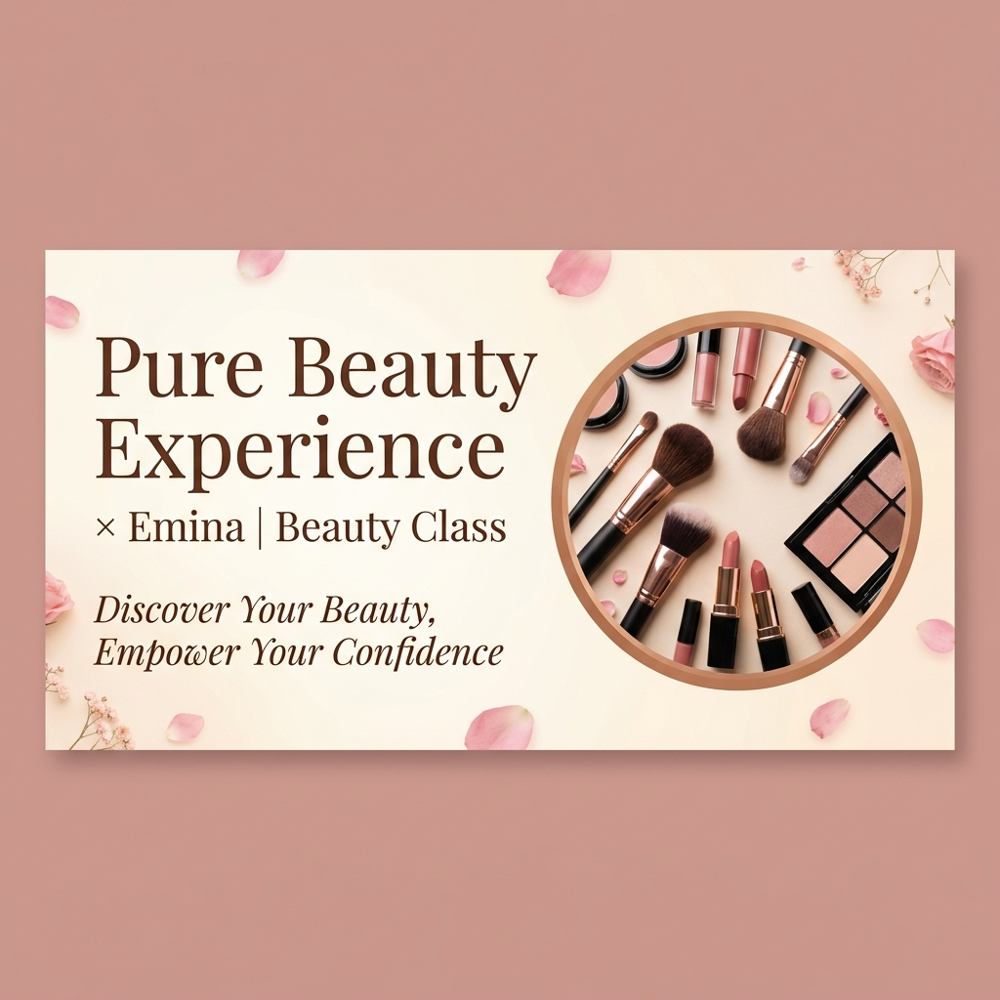

# 🌸 Pure Beauty Experience

> Website portofolio dan landing page resmi untuk event **Beauty Class × Emina** yang diselenggarakan di Tomoro Coffee, Golden City, Bekasi.



Website ini dirancang secara elegan, modern, dan feminin dengan dominasi warna *Rose Gold* dan *Dusty Pink*. Dirancang untuk memberikan pengalaman premium, mulai dari animasi halus, tata letak yang estetik, hingga galeri bergaya Instagram.

## ✨ Fitur Utama

- 📱 **Fully Responsive:** Tampilan sempurna di desktop, tablet, maupun layar mobile terkecil.
- 🎨 **Premium Aesthetics:** Desain eksklusif dengan warna *Rose Gold* khusus (`#C9956A`), gradasi lembut, efek *glassmorphism*, dan tipografi elegan (Kombinasi *Playfair Display* & *Nunito*).
- 📸 **Instagram-style Gallery:** Galeri foto dan dokumentasi video interaktif. Video dilengkapi thumbnail otomatis yang di-*generate* dari video aslinya dengan desain tombol "Play" minimalis dan transisi hover ala Instagram.
- 🚀 **SEO Optimized:** 
  - Sitemaps (`/sitemap.xml`) dan Robots (`/robots.txt`) otomatis.
  - JSON-LD Rich Snippet (Tipe: Event) tertanam untuk memudahkan Google menampilkan informasi jadwal, lokasi, dan detail acara.
  - OpenGraph Metadata untuk preview link yang cantik jika dibagikan ke WhatsApp, Instagram, atau TikTok.
- ⚡ **Performa Cepat:** Dibangun menggunakan Next.js App Router terbaru dengan pemuatan gambar statis yang optimal (`next/image`).

## 🛠️ Tech Stack

- **Framework:** [Next.js 14](https://nextjs.org/) (App Router)
- **Language:** TypeScript
- **Styling:** Vanilla CSS Modules (tanpa dependensi framework CSS eksternal demi kontrol presisi)
- **Icons:** [Lucide React](https://lucide.dev/)

## 📂 Struktur Halaman

1. **Home (`/`)** — Landing page dengan *Hero section*, detail kegiatan, testimoni, dan CTA (*Call to Action*).
2. **About (`/about`)** — Halaman pengenalan *speaker*, rincian sesi *beauty class*, jadwal lengkap (*Rundown*), dan detail kolaborator (Emina).
3. **Gallery (`/gallery`)** — Album dokumentasi acara berisi gabungan foto dan video momen berkesan peserta. Dilengkapi *Lightbox* interaktif untuk memutar video atau zoom gambar.
4. **Contact (`/contact`)** — Pusat bantuan dan pendaftaran. Mengarahkan langsung ke WhatsApp resmi, TikTok, dan Instagram. Dilengkapi panduan FAQ.

---

## 💻 Cara Menjalankan di Lokal (Local Development)

Jika Anda ingin memodifikasi atau menjalankan website ini di komputer lokal Anda:

1. **Clone repository ini** (jika belum ada di komputer lokal)
   ```bash
   git clone https://github.com/maulaknatt/beauty-experience.git
   cd beauty-experience
   ```

2. **Install semua dependensi (pilih salah satu)**
   ```bash
   npm install
   # atau
   yarn install
   # atau
   pnpm install
   ```

3. **Jalankan Development Server**
   ```bash
   npm run dev
   # atau
   yarn dev
   # atau
   pnpm dev
   ```

4. **Buka di Browser**
   Buka [http://localhost:3000](http://localhost:3000) untuk melihat hasilnya. Halaman akan otomatis *reload* jika Anda melakukan perubahan kode.

---

## 🚀 Cara Deploy ke Vercel

Aplikasi ini sangat siap dan disarankan untuk di-deploy secara gratis menggunakan [Vercel](https://vercel.com/):

1. Login ke akun Vercel dengan GitHub Anda.
2. Klik tombol **Add New Project**.
3. Pilih/Import repository `beauty-experience` dari GitHub Anda.
4. Biarkan semua settingan secara **default** (Framework akan terdeteksi sebagai Next.js otomatis).
5. Klik **Deploy** dan tunggu 1-2 menit hingga selesai.
6. (Opsional) Tambahkan domain kustom (seperti `beautyexperience.my.id`) melalui menu **Settings > Domains** di dashboard Vercel, lalu ikuti instruksi konfigurasi *A Record*/*CNAME* di panel domain Anda.

---
*Created with ❤️ by Antigravity for Pure Beauty Experience.*
